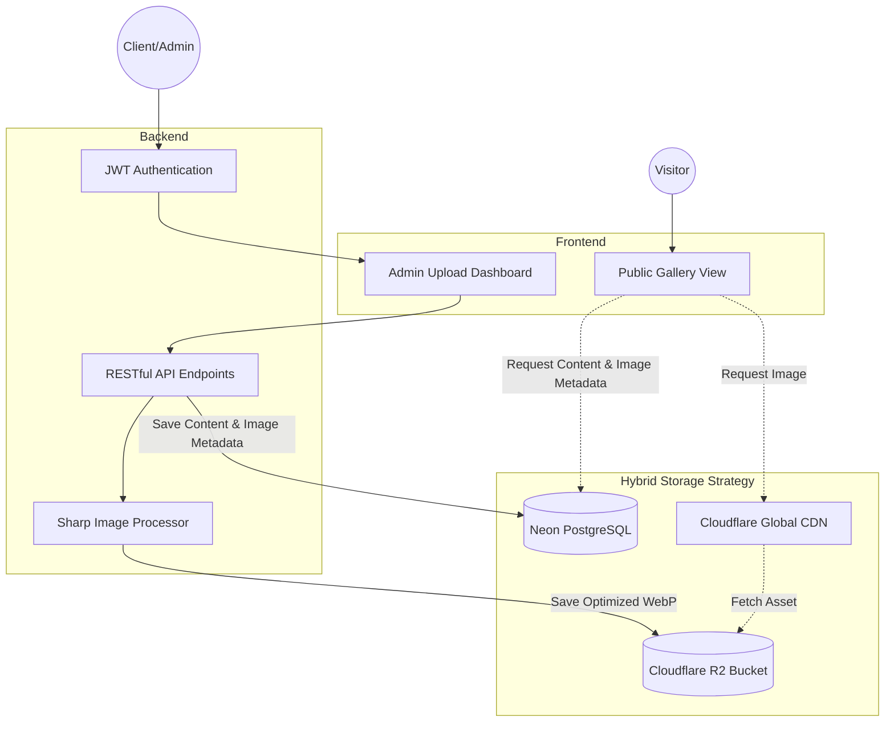

# Tian’s Photography Platform

A high-performance, full-stack portfolio and gallery management system designed to showcase the professional works of Tian. This platform prioritizes visual fidelity while maintaining web performance through automated image processing and edge-caching strategies. **All photographs featured on this platform are the exclusive property of Tian.**

## Key Technical Achievements
* **Sub-500ms Performance**: Leveraged **Cloudflare Edge-Caching** and **Neon PostgreSQL** to achieve sub-500ms page loads.
* **60% LCP Optimization**: Engineered a pipeline using **Sharp** to convert raw assets into multi-resolution **WebP** formats, significantly reducing Largest Contentful Paint (LCP).
* **Production-Grade CI/CD**: Maintained **95%+ backend code coverage** with Vitest and Supertest, integrated into a GitHub Actions pipeline for zero-downtime deployments.

## Tech Stack

| Layer | Technology |
| :--- | :--- |
| **Frontend** | React.js, HTML/CSS |
| **Backend** | Node.js, Express.js |
| **Database** | PostgreSQL |
| **Storage** | Cloudflare R2 (S3-compatible)|
| **Testing** | Vitest, Supertest |
| **Deployment** | Vercel, GitHub Actions |

## System Architecture

